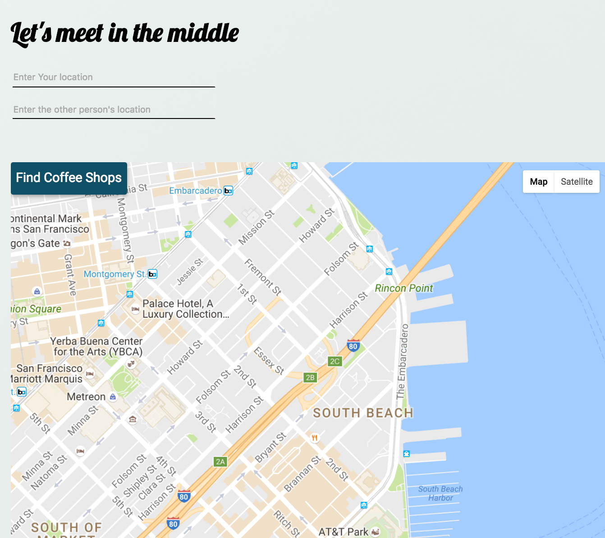

# MiddleMax Enhancement

This is an open source Mixmax Enhancement.

It allows users to enter 2 different locations and find coffee spots that are located half way between locations.

## Running locally

1. Clone this repo
2. Install using `npm install`
3. Run using `npm start`

To test the editor locally, go to <http://localhost:8910/editor> in your browser.
